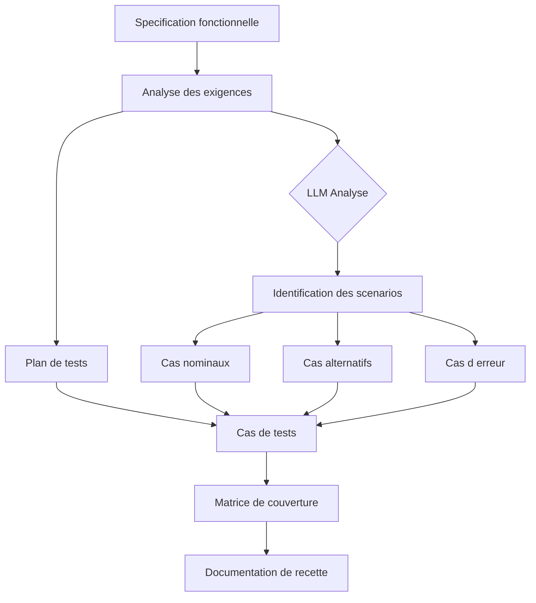

# TestsLogiciels

> **Generateur de documentation de tests logiciels par IA**
> De la strategie de tests jusqu'aux cas de tests detailles - automatisez toute la chaine documentaire de votre recette logicielle avec l'intelligence artificielle.

[](https://www.python.org/)
[](https://openrouter.ai/)
[](LICENSE)

---

## Table des matieres

- [Presentation](#presentation)
- [Fonctionnalites](#fonctionnalites)
- [Workflow de generation](#workflow-de-generation)
- [Types de documents generes](#types-de-documents-generes)
- [Installation](#installation)
- [Utilisation](#utilisation)
- [Format des documents](#format-des-documents)
- [Roadmap](#roadmap)
- [Licence](#licence)

---

## Presentation

**TestsLogiciels** est un outil de generation automatique de documentation de tests logiciels propulse par IA. A partir d'une specification fonctionnelle ou d'une description de fonctionnalite, il produit l'ensemble de la documentation de recette :

- **Plan de tests** : Strategie, perimetre, types de tests, criteres d'acceptation
- **Cas de tests** : Scenarios detailles avec preconditions, etapes, donnees et resultats attendus
- **Matrice de couverture** : Couverture des exigences par les tests
- **Rapport de recette** : Synthese et decision de validation

Concu pour les equipes QA, les chefs de projet, les MOE et MOA qui souhaitent accelerer la production documentaire des phases de recette.

---

## Fonctionnalites

- **Generation complete** : De la strategie jusqu'aux cas de tests operationnels
- **Multi-formats** : Export en Markdown, Excel ou PDF
- **Contexte metier** : Prise en compte du domaine fonctionnel (finance, sante, industrie...)
- **Niveaux de tests** : Unitaires, integration, systeme, acceptation (UAT)
- **Techniques de test** : Classes d'equivalence, valeurs limites, arbres de decision
- **Traçabilite** : Lien entre exigences et cas de tests
- **Personnalisable** : Templates adaptables aux conventions de l'equipe

---

## Workflow de generation



---

## Types de documents generes

### 1. Plan de tests

```markdown
# Plan de Tests - [Nom du projet]

## 1. Objectifs
## 2. Perimetre
   - Fonctionnalites testees
   - Fonctionnalites exclues
## 3. Strategie
   - Types de tests (unitaire, integration, UAT)
   - Niveaux de couverture requis
## 4. Criteres d'entree et de sortie
## 5. Environnements de tests
## 6. Risques et mitigations
```

### 2. Cas de tests

```markdown
# CT-001 : [Description du cas de test]

**Module** : [Nom du module]
**Priorite** : Haute / Moyenne / Basse
**Type** : Cas nominal / Cas alternatif / Cas d'erreur

## Preconditions
- L'utilisateur est authentifie
- Les donnees de reference sont chargees

## Etapes
| # | Action | Donnees | Resultat attendu |
|---|---|---|---|
| 1 | Ouvrir la page X | - | La page s'affiche |
| 2 | Saisir la valeur Y | Y = "test" | Le champ est renseigne |
| 3 | Cliquer sur Valider | - | Le message de succes s'affiche |

## Resultat attendu
L'action est enregistree avec succes.

## Criteres de validation
- [ ] Message de confirmation affiche
- [ ] Donnee sauvegardee en base
- [ ] Log d'audit cree
```

### 3. Matrice de couverture

| Exigence | CT-001 | CT-002 | CT-003 | Couverture |
|---|---|---|---|---|
| EXG-001 - Authentification | X | X | - | 100% |
| EXG-002 - Saisie formulaire | X | - | X | 100% |
| EXG-003 - Export donnees | - | X | X | 100% |

---

## Installation

```bash
# Cloner le depot
git clone https://github.com/dagornc/TestsLogiciels.git
cd TestsLogiciels

# Installer les dependances
python -m venv venv
source venv/bin/activate
pip install -r requirements.txt

# Configurer l'environnement
cp .env.example .env
# Renseigner votre cle API LLM dans .env
```

---

## Utilisation

### En ligne de commande

```bash
# Generer un plan de tests depuis une specification
python main.py --input spec.md --output plan_tests.md --type plan

# Generer des cas de tests
python main.py --input spec.md --output cas_tests.md --type cases

# Generation complete (plan + cas + matrice)
python main.py --input spec.md --output docs/ --type all
```

### Exemple d'entree

```markdown
# Specification - Module Authentification

L'utilisateur doit pouvoir se connecter avec son email et mot de passe.
En cas de 3 echecs consecutifs, le compte doit etre bloque.
Un email de reinitialisation est envoye si le mot de passe est oublie.
```

### Sortie generee

```
docs/
|-- plan_tests.md           # Plan de tests complet
|-- cas_tests/
|   |-- CT-001_connexion_nominale.md
|   |-- CT-002_echec_authentification.md
|   |-- CT-003_blocage_compte.md
|   |-- CT-004_reinitialisation_mdp.md
|-- matrice_couverture.xlsx # Traçabilite exigences/tests
|-- rapport_recette.md      # Synthese validation
```

---

## Variables d'environnement

```env
# Provider LLM
OPENROUTER_API_KEY=sk-or-...
LLM_MODEL=mistralai/mistral-large

# Options de generation
LANGUAGE=fr
MAX_TEST_CASES=50
COVERAGE_LEVEL=standard  # minimal, standard, exhaustif
```

---

## Techniques de test supportees

| Technique | Description | Usage |
|---|---|---|
| Classes d'equivalence | Partitionne les entrees en classes | Formulaires, champs de saisie |
| Valeurs limites | Teste les bornes des plages valides | Champs numeriques |
| Tableau de decision | Combine conditions et actions | Regles metier complexes |
| Cas d'utilisation | Base sur les scenarios utilisateur | Workflows |
| Exploratory testing | Tests non scripto | Decouverte de bugs |

---

## Roadmap

- [x] Generation de plan de tests
- [x] Generation de cas de tests detailles
- [x] Cas nominaux, alternatifs et d'erreur
- [x] Export Markdown
- [ ] Interface web (FastAPI + React)
- [ ] Import depuis Jira / Confluence / Notion
- [ ] Export vers TestRail, Xray, Zephyr
- [ ] Integration CI/CD (GitHub Actions)
- [ ] Generation depuis diagrammes UML / BPMN
- [ ] Support multi-langues (FR/EN/ES)
- [ ] Mode review : validation humaine avant export

---

## Licence

Ce projet est sous licence **MIT**.

---

> Construit par [dagornc](https://github.com/dagornc) - Accelerer la qualite logicielle par l'IA.
